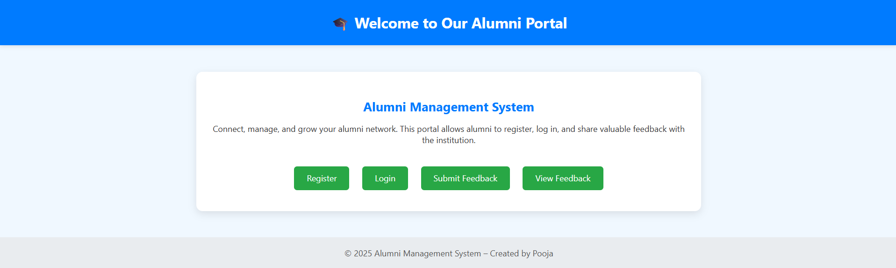
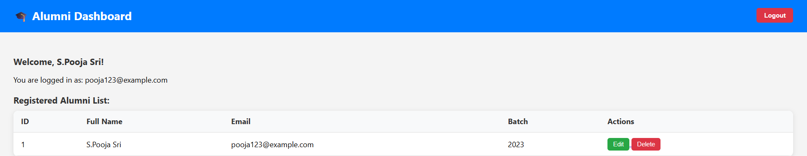

# 🎓 Alumni Management System

A web-based system for managing alumni registration, login, feedback, and dashboard access.

## ⚙ Features
- ✅ Alumni registration & login (with password hashing)
- 🗂 Dashboard with alumni list (Edit/Delete)
- ✍ Submit and view feedback
- 🔐 Session-based login system
- 🎨 Simple CSS styling for better UI

## 🗃 Database Tables

### alumni_users
- id (INT, AUTO_INCREMENT, PRIMARY KEY)
- full_name (VARCHAR)
- email (VARCHAR, UNIQUE)
- password (VARCHAR)
- batch (YEAR)

### feedback
- id (INT, AUTO_INCREMENT, PRIMARY KEY)
- name (VARCHAR)
- email (VARCHAR)
- message (TEXT)
- submitted_on (TIMESTAMP)

## 📸 Screenshots

### Home Page

### Dashboard

### View Feedback

## 👩‍💻 Created by: Pooja, 2025
