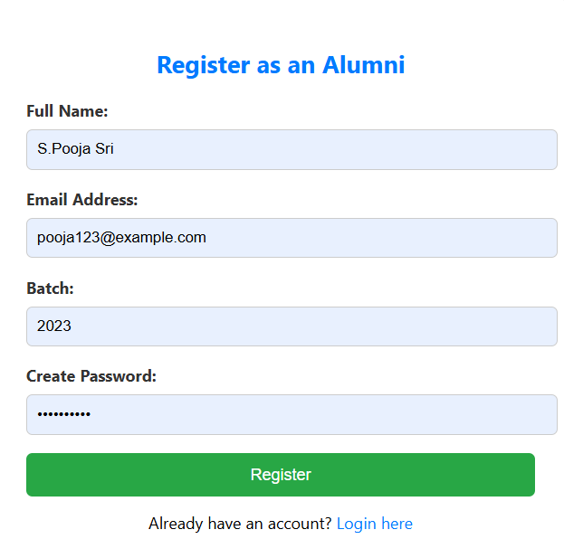
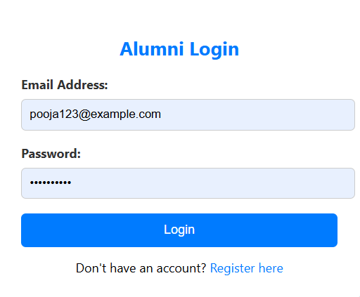
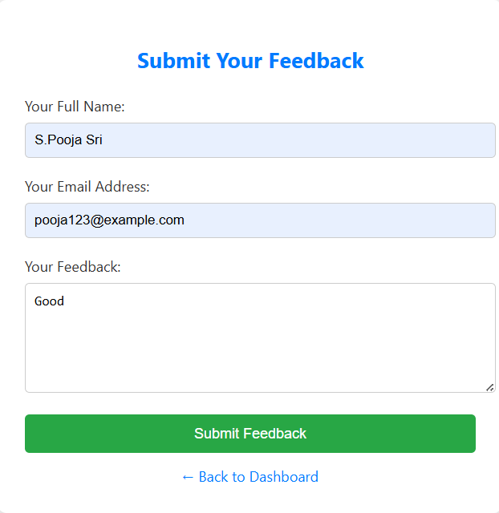
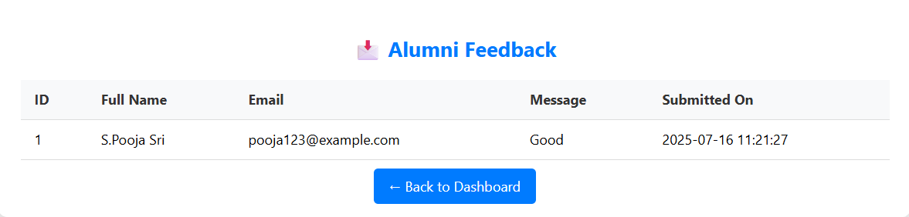

# 🎓 Alumni Management System

The *Alumni Management System* is a web-based platform designed to help educational institutions maintain and manage data related to alumni. It allows alumni to register, log in, submit feedback, and stay connected with the institution and other alumni.

---

## 📁 Features

- 📝 Alumni Registration
- 🔐 Secure Login System
- 📋 View Registered Alumni
- 💬 Submit Feedback
- 🧾 View Feedback List
- 🚪 Logout Option
- 🎨 Styled with HTML & CSS
- 💻 Developed using PHP and MySQL

---

## 🛠 Technologies Used

- *Frontend:* HTML, CSS
- *Backend:* PHP
- *Database:* MySQL
- *Server Environment:* Laragon

---

## 🧱 Database Tables

### 1. alumni_users
| Field         | Type         |
|---------------|--------------|
| id            | INT (Primary Key, Auto Increment) |
| full_name     | VARCHAR(100) |
| email         | VARCHAR(100) (Unique) |
| password      | VARCHAR(255) |

---

### 2. feedback
| Field         | Type         |
|---------------|--------------|
| id            | INT (Primary Key, Auto Increment) |
| full_name     | VARCHAR(100) |
| email         | VARCHAR(100) |
| message       | TEXT         |
| submitted_on  | TIMESTAMP (default CURRENT_TIMESTAMP) |

---

## 🔐 How to Run the Project

1. Install *Laragon* and start Apache & MySQL.
2. Place the project folder inside C:\laragon\www\alumni.
3. Access the app in your browser at:  
   http://alumni.test:8080
4. Import the SQL database using phpMyAdmin:
   - Open http://localhost:8080/phpmyadmin
   - Create database: alumni_db
   - Import the .sql file (if you exported it)
5. Register a new user and login.

---

## 🖼 Project Screenshots

### 🏠 Home Page
Welcome page of the Alumni Management System.

---

### 📝 Register Page
User registration form.

---

### 🔐 Login Page
User login form with authentication.

---

### 📊 Dashboard
After login, it shows welcome message and alumni list.

---

### 💬 Submit Feedback
Form to submit feedback to the admin.

---

### 📋 View Feedback
Displays all submitted feedback from users.

---

## 👩‍💻 Project By

> *Pooja Sri.S*
> B.E-CSE
> Roll NO:23676
> Class Project Submission — 2025  
> Alumni Management System using PHP & MySQL
